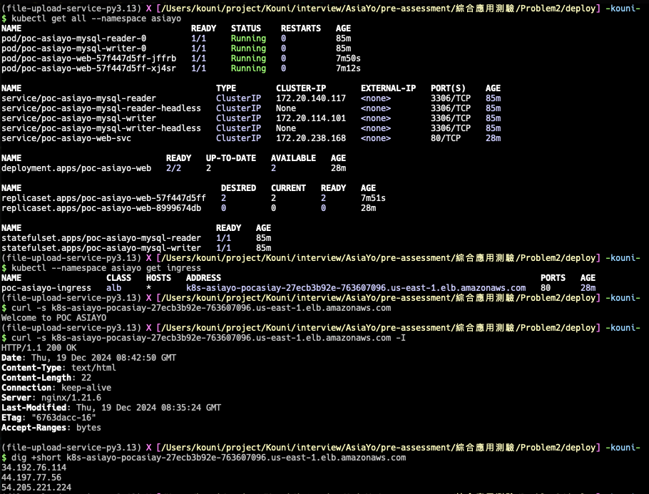

# Build POC Environment

## AWS EKS

#### Solution

透過 terraform 來建置以高可用性(最小高可用)為主軸的 EKS 架構設計特徵:

1. 參照 Terraform Best Practices 來規劃可續用維護的目錄結構
2. Multi-AZ 的 EKS cluster，並有兩個的 worker node，來滿足最小基本高可用需求
3. 所有資源上 tag 友善後續續維護以及分帳
4. 完整 VPC 規劃(public/private/Isolate)
5. AutoScaling
6. EBS CSI addon
7. AWS Load Balancer Controller
8. 採用 arm 架構的 Bottlerocket platform

#### Quick Reference Guide for Creating a Cluster

In PATH: aws-eks-ha-tf/

```bash
$ terraform init
$ terraform validate
$ terraform plan -out=./tf_out/tfplan
$ terraform apply "./tf_out/tfplan"
```

## Application

### MySQL

題中畫的似乎一個 Statefulset 裡面分別透過兩個 pod 來處理 read/write，
理論上可以做到，但是實務上似乎不太會這樣使用，因此先設計成兩個 Statefulsets，
分別定義以及處理讀寫分離。

#### Solution

- 尚未有更複雜需求以前先不 Overengineering
- 透過 helm 建立一個 architecture 為 replication 的 MySQL
- 支援讀且分離
- 2GB storage(using sc)

#### Quick Reference Guide

In PATH: deploy/mysql/

```bash
$ helm repo add bitnami https://charts.bitnami.com/bitnami && helm repo update

# 建立 StorageClass 供後面部署步驟使用
$ kubectl apply -f pre-requirements-manifest/storage-class.yaml

# 透過 helm 建立一個 architecture 為 replication 的 MySQL
$ helm upgrade --install poc-mysql bitnami/mysql \
    --namespace asiayo \
    --create-namespace \
    -f values.yaml

```

### Other Resource

建立圖題中的其他資源:

- Persistentvolumes
  - deploy/manifest/pv.yaml
- Persistentvolumeclaims
  - deploy/manifest/pvc.yaml
- Deployments
  - deploy/manifest/deployment.yaml
- Services
  - deploy/manifest/service.yaml
- Ingress
  - deploy/manifest/ingress.yaml

In PATH: deploy/manifest/
```bash
$ kubectl --namespace asiayo apply -f ingressclass.yaml
ingressclass.networking.k8s.io/alb created

$ kubectl apply -f sc.yaml
storageclass.storage.k8s.io/poc-asiayo-sc created

$ kubectl --namespace asiayo apply -f pvc.yaml
persistentvolumeclaim/poc-asiayo-pvc created

$ kubectl --namespace asiayo apply -f deployment.yaml
deployment.apps/poc-asiayo-web created

$ kubectl --namespace asiayo apply -f service.yaml
service/poc-asiayo-web-svc created
````


### Screenshot


#### TBD

- HPA
- Implement reading and writing to MySQL and present interactions.